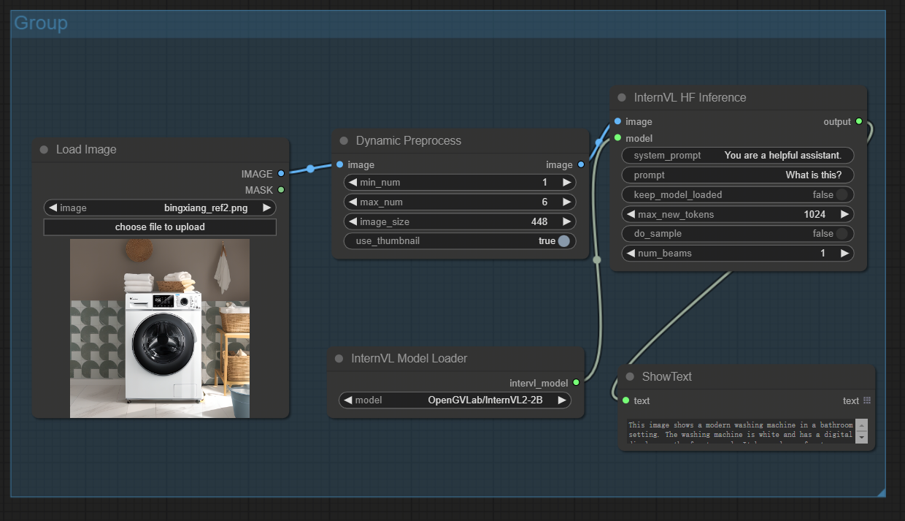

# ComfyUI nodes to use InternVL2

https://github.com/OpenGVLab/InternVL

## Install

- 推荐使用管理器 ComfyUI Manager 安装（On the Way）

- 手动安装：
    1. `cd custom_nodes`
    2. `git clone https://github.com/leeguandong/ComfyUI_InternVL2.git`
    3. 重启 ComfyUI

## Use

- https://huggingface.co/OpenGVLab/InternVL2-1B

- 节点：

   - InternVL Model Loader：自动加载 InternVL 模型
   - Dynamic Preprocess：动态分辨率
   - InternVL HF Inference：transformers原生推理
   - InternVL LMDEPLOY Inference:InternVL推荐的LMDEPLOY推理

## Stars 

